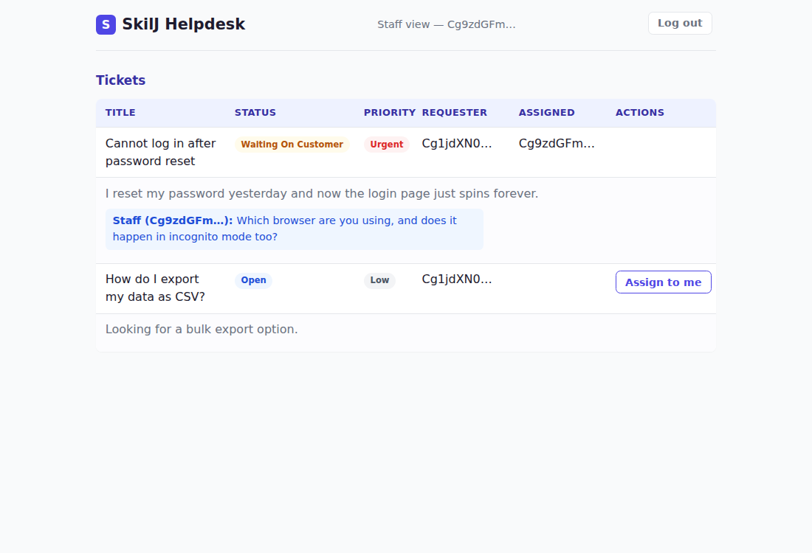

# skilj-helpdesk

A showcase SaaS helpdesk built on [skilj](../skilj) — a Rust library for
event-sourced, DDD-style applications. This project exists to exercise
skilj for real: every piece below was built, run, and verified against
a live stack, not just written and assumed to work.

**Start here:** [`specs/skilj-helpdesk.allium`](specs/skilj-helpdesk.allium)
is the domain spec — scope, entities, rules, and surfaces, written with
[Allium](https://allium-lang.org/). Every rule in it has a real
implementation; the spec's own comments note the couple of deliberate
simplifications (see "What's not built" below).



## What this is

- **A company** signs up for a free trial, then must convert to a paid
  subscription (mocked payment) or lose the ability to create new
  tickets — reversibly; they can always come back.
- **Customers** file support tickets; **staff** work through them
  (assign → resolve → close, with a request-info/waiting-on-customer
  detour).
- **Alerting**: urgent tickets, and tickets nobody's picked up in a
  while, page a lead — via a separately-deployable consumer of skilj's
  own REST event feed, not anything built into skilj itself.
- **Two deadline-driven rules** (trial conversion, ticket auto-close)
  are driven by another separately-deployable consumer, for the same
  reason: skilj's own scheduling primitive fires on a shared cron, not
  per-entity deadlines.
- **A real login**: a self-hosted OIDC provider (Dex), Authorization
  Code + PKCE, a real customer/staff dashboard in the browser.

## Layout

| Path | What |
|---|---|
| `specs/skilj-helpdesk.allium` | The domain spec |
| `src/helpdesk.rs` | Every `EventType`/`CommandType`/`Projection` — the actual domain logic |
| `src/alerting.rs`, `src/scheduling.rs` | Pure decision logic the two background binaries drive |
| `src/telemetry.rs` | Shared OTel wiring all three binaries call into (see "Telemetry & dashboards" below) |
| `src/demo_seed.rs` | Pure decision logic behind the optional fake-traffic loop (`SEED_DEMO_TRAFFIC=1`) |
| `src/bin/server.rs` | The runnable server (REST + GraphQL) |
| `src/bin/alerter.rs` | Consumes the event feed, pages a lead on urgent/overdue tickets |
| `src/bin/scheduler.rs` | Consumes the event feed, converts/expires trials and auto-closes tickets |
| `tests/` | Integration tests (real HTTP, real Postgres) — split into several files by concern; see `tests/company.rs`'s own doc comment for why |
| `dex/config.yaml` | The real OIDC provider's config (two demo logins) |
| `frontend/` | The Leptos (WASM) web app |
| `observability/` | Local Grafana/Prometheus/Tempo/Loki stack + provisioned dashboard (see below) |

## Running it

You'll need: a Postgres database, Go (only to build Dex once — no
prebuilt binary exists), `wasm32-unknown-unknown` + [trunk](https://trunkrs.dev/)
(only for the frontend).

**Shortcut**: once Dex is built (step 1 below), `scripts/dev.sh` does
steps 2-3's server half in one command — starts a throwaway local
Postgres (unless `DATABASE_URL` is already set), Dex if it finds a
built binary, then the server, and tears all three down cleanly on
Ctrl+C. Still a separate `cd frontend && trunk serve` for the UI. The
steps below are what it's actually doing, spelled out.

**1. Build Dex once** (a real OIDC provider — no prebuilt binary, no
Docker assumed):

```sh
git clone --depth 1 --branch v2.45.1 https://github.com/dexidp/dex.git
cd dex && go build -o dex ./cmd/dex
```

Run it against this project's config: `./dex serve dex/config.yaml`
(listens on `127.0.0.1:5556`).

**2. Start the server**, pointed at a real Postgres and at Dex:

```sh
DATABASE_URL=postgres://... OIDC_ISSUER_URL=http://127.0.0.1:5556/dex \
  cargo run --bin server
```

It prints every credential the rest of this needs, and the exact
commands to run `alerter`/`scheduler` against it. Sign up the demo
company it references (`curl` example included in its own output)
before there's anything to see.

**3. Run the frontend**:

```sh
cd frontend && trunk serve
```

Open `http://127.0.0.1:8081`. Log in as `customer@acme.example` /
`customer-demo-pw` (customer view) or `lead@acme.example` /
`staff-demo-pw` (staff view) — see `dex/config.yaml`.

**4. Optionally, the two background binaries** — each prints its own
required env vars when `server` starts:

```sh
cargo run --bin alerter    # pages a lead on urgent/overdue tickets
cargo run --bin scheduler  # converts/expires trials, auto-closes tickets
```

**Tests**: `cargo test` — real integration tests against a real (or
[`postgresql_embedded`](https://crates.io/crates/postgresql_embedded))
Postgres; DB-dependent ones skip cleanly if neither is reachable.
`cd frontend && cargo test --target wasm32-unknown-unknown` isn't a
thing (no frontend unit tests this pass) — it's verified by actually
running it (see below).

## Telemetry & dashboards

`skilj-core`/`skilj-rest`/`skilj` already emit real `tracing` spans and
OTel metrics throughout (command outcomes, event throughput, REST
request latency, background-task health) — all three of this project's
binaries now wire that up for real (`src/telemetry.rs`, the same
reference pattern `skilj-demo/src/bin/server.rs` establishes), and
`observability/` is a local Grafana stack to actually look at it, plus
an optional fake-traffic generator so there's something moving.

**1. Bring up the stack** (an OTel Collector + Prometheus + Tempo + Loki
+ Grafana, entirely separate from the Postgres/Dex steps above — see
`observability/docker-compose.yml`'s own doc comment):

```sh
docker compose -f observability/docker-compose.yml up -d
```

**2. Point the binaries at it** — `OTEL_EXPORTER_OTLP_ENDPOINT` unset
(the default) still works exactly as before, console-only:

```sh
export OTEL_EXPORTER_OTLP_ENDPOINT=http://localhost:4318
cargo run --bin server      # and, in their own terminals, alerter/scheduler
```

**3. Open Grafana** at <http://localhost:3000> (no login needed locally
— anonymous admin, see the compose file) — the "skilj-helpdesk overview"
dashboard is already there, auto-provisioned, refreshing every 5s.
Traces and logs are in Grafana's own Explore view against the Tempo/Loki
datasources (also auto-provisioned, cross-linked from a trace to its own
logs).

**4. Optionally, generate fake traffic** so the dashboard actually has
something to show without driving curl by hand — `SEED_DEMO_TRAFFIC=1`
on `server` spawns a background loop (`src/demo_seed.rs`) that signs up
a small cast of fake companies (`wonka-industries`, `stark-labs`,
`hooli` — distinct from this README's own `acme` walkthrough company)
and keeps creating/assigning/resolving fake tickets against this same
server's own REST surface, occasionally urgent (so `alerter` has
something to page on) and occasionally a deliberately invalid
transition (so the dashboard's rejection-rate panel isn't always zero):

```sh
SEED_DEMO_TRAFFIC=1 cargo run --bin server
# SEED_DEMO_INTERVAL_MS=... to change the pace (default 4000)
```

**Want more load?** `SEED_DEMO_CONCURRENCY=N` runs `N` independent
fake-traffic workers instead of one, each pacing itself at
`SEED_DEMO_INTERVAL_MS` — roughly `N`× the request rate, spread smoothly
rather than bursting in lockstep (each worker staggers its own first
tick). Turn this up when you actually want the dashboard's rate/latency
panels moving hard, e.g.:

```sh
SEED_DEMO_TRAFFIC=1 SEED_DEMO_CONCURRENCY=10 SEED_DEMO_INTERVAL_MS=200 cargo run --bin server
```

Run `scheduler` alongside it with short deadlines
(`TRIAL_DURATION_DAYS=0 AUTO_CLOSE_AFTER_DAYS=0 cargo run --bin
scheduler` — both already-supported env vars, just unused until now) to
see trial-conversion and auto-close traffic immediately too, instead of
after real days.

**All in one command**: `scripts/dev.sh` does steps 1-2 for you when
`OTEL=1` is set, and passes `SEED_DEMO_TRAFFIC` straight through:

```sh
OTEL=1 SEED_DEMO_TRAFFIC=1 scripts/dev.sh
```

Tear the observability stack down with
`docker compose -f observability/docker-compose.yml down -v` (or just
Ctrl+C `dev.sh`, if that's what started it) — nothing in it persists on
purpose.

## What's not built

Noted here, and in the relevant file's own doc comment, rather than
silently absent:

- **Real payment processing** — mocked on purpose; this is a showcase,
  not a billing product.
- **Multi-tenant provisioning** — the spec calls for each company to be
  its own skilj tenant (bounded context), stamped from a template via
  `CreateBoundedContextFromTemplate`. This pass keeps one shared
  bounded context instead, to prove the domain logic without also
  building the tenancy mechanism around it.
- **A backend-for-frontend / GraphQL schema beyond what's registered**
  — the frontend talks to skilj-graphql's own auto-generated schema
  directly; there's no hand-written GraphQL layer.

## Real bugs this project found (and fixed)

Verifying everything against a live stack — not just "it compiles" —
surfaced four real bugs, each confirmed failing first, then fixed:

1. **skilj-core**: JWT audience validation was never configured, so any
   spec-compliant OIDC token (which always carries `aud`) was rejected
   outright. Fixed in skilj-core itself (`validate_aud = false`, matching
   its own stated design).
2. **This project's `server.rs`**: re-seeded the two demo `Role`s on
   every restart, violating a uniqueness constraint on the second run.
   Fixed with a check-before-insert.
3. **This project's `server.rs`**: no CORS headers, so a real browser
   frontend was blocked outright. Fixed where the REST/GraphQL routers
   are merged (a per-deployment decision, correctly made here rather
   than baked into skilj itself).
4. **The frontend**: a double-unwrap bug parsing the projection query
   response — found by actually running it in a headless browser
   against the real stack, not by inspection.
