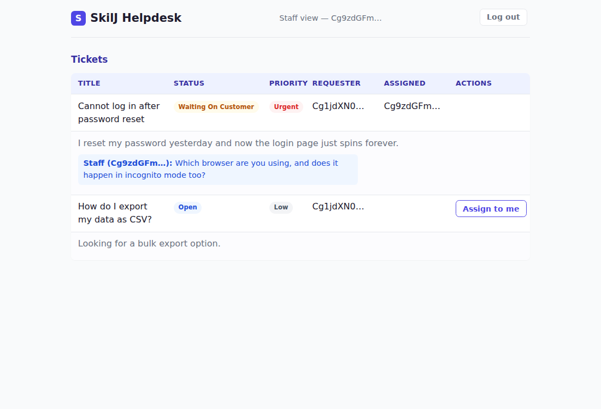
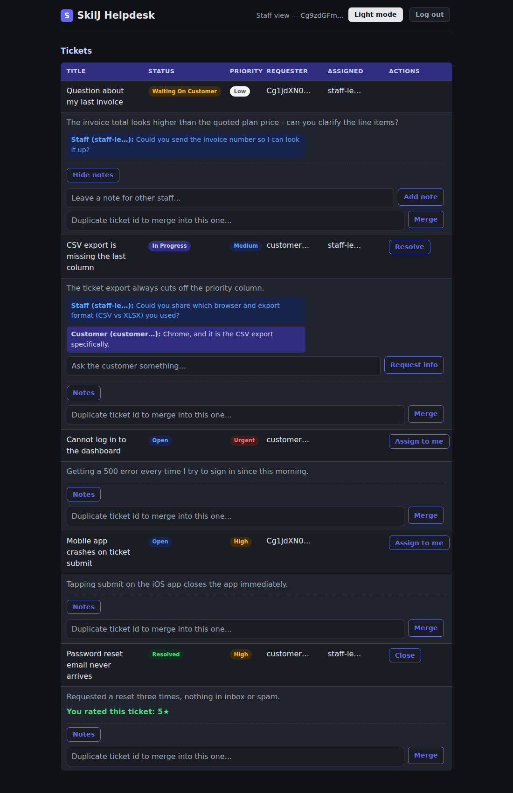
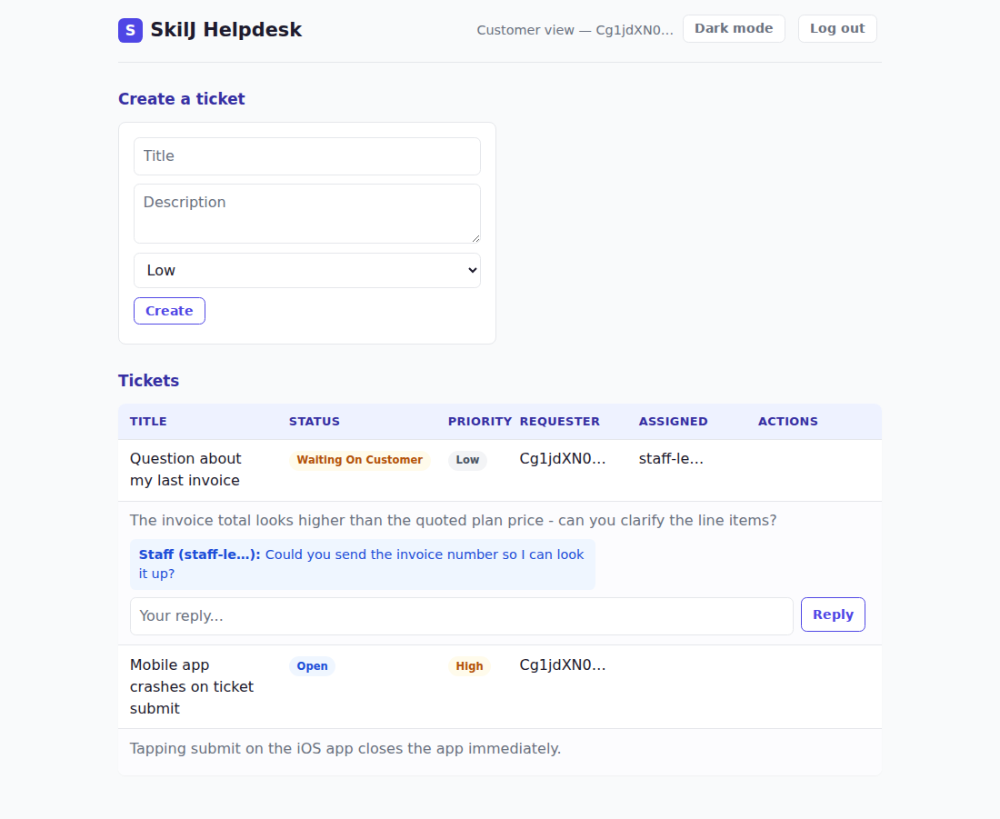
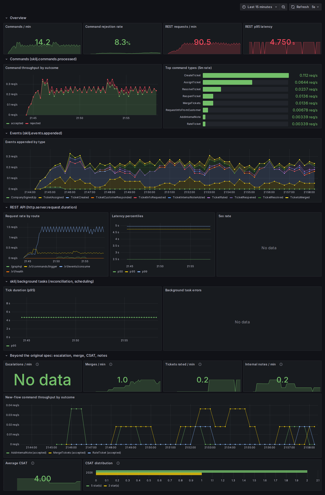

# skilj-helpdesk

[](https://github.com/gklijs/sklij-helpdesk/actions/workflows/ci.yml)

A showcase SaaS helpdesk built on [skilj](../skilj) — a Rust library for
event-sourced, DDD-style applications. This project exists to exercise
skilj for real: every piece below was built, run, and verified against
a live stack, not just written and assumed to work.

**Start here:** [`specs/skilj-helpdesk.allium`](specs/skilj-helpdesk.allium)
is the domain spec — scope, entities, rules, and surfaces, written with
[Allium](https://allium-lang.org/). Every rule in it has a real
implementation; the spec's own comments note the couple of deliberate
simplifications (see "What's not built" below).



<details>
<summary>More screens: dark mode, the customer view, and the monitoring dashboard</summary>

|  |  |
|---|---|
|  |  |
| Dark mode — a manual override on top of the system default, see "A real login" below | The customer view — same app, same login page, a different role |



</details>

## What this is

- **A company** signs up for a free trial, then must convert to a paid
  subscription (mocked payment) or lose the ability to create new
  tickets — reversibly; they can always come back.
- **Customers** file support tickets; **staff** work through them
  (assign → resolve → close, with a request-info/waiting-on-customer
  detour).
- **Alerting**: urgent tickets page a lead immediately; a ticket
  nobody's handled in a while gets escalated (priority bumped, a real
  persisted `TicketEscalated`, not just a console alert) and paged too —
  via a separately-deployable consumer of skilj's own REST event feed,
  not anything built into skilj itself.
- **Two deadline-driven rules** (trial conversion, ticket auto-close)
  run through skilj's own native per-entity deadline mechanism
  (`ScheduleDeadline`) - no separate process needed, unlike alerting:
  skilj's cron-based scheduling primitive fires on a shared schedule for
  a whole event type, not per-entity deadlines, but 0.0.7 added a
  one-shot timer scoped to a single entity's own tags, purpose-built for
  exactly this.
- **Three more flows beyond the original spec** — ticket merging (a real
  showcase of skilj's own DCB model reading two tickets' own histories
  in one command, no aggregate boundary needed), CSAT ratings, and
  staff-only internal notes — each grounded in how Zendesk/Freshdesk/
  Jira Service Management actually work, added to give the telemetry
  work below genuinely varied traffic to show.
- **A real login**: a self-hosted OIDC provider (Dex), Authorization
  Code + PKCE, a real customer/staff dashboard in the browser — with a
  dark mode (`frontend/src/theme.rs`) that follows the system's own
  `prefers-color-scheme` by default, overridable per browser via the
  toggle next to "Log out"/"Log in".

## Layout

| Path | What |
|---|---|
| `specs/skilj-helpdesk.allium` | The domain spec |
| `src/helpdesk.rs` | Every `EventType`/`CommandType`/`Projection` — the actual domain logic |
| `src/alerting.rs` | Pure decision logic `src/bin/alerter.rs` drives |
| `src/scheduling.rs` | Env-driven durations + the mocked payment call `src/helpdesk.rs`'s own deadline reactors (`ScheduleCompanyTrialConversion`/`ScheduleTicketAutoClose`) use |
| `src/telemetry.rs` | Shared OTel wiring all three binaries call into (see "Telemetry & dashboards" below) |
| `src/demo_seed.rs` | Pure decision logic behind the optional fake-traffic loop (`SEED_DEMO_TRAFFIC=1`) |
| `src/bin/server.rs` | The runnable server (REST + GraphQL) |
| `src/bin/alerter.rs` | Consumes the event feed, pages a lead on urgent tickets and escalates ones nobody's handled in time |
| `tests/` | Integration tests (real HTTP, real Postgres) — split into several files by concern; see `tests/company.rs`'s own doc comment for why |
| `dex/config.yaml` | The real OIDC provider's config (two demo logins) |
| `frontend/` | The Leptos (WASM) web app |
| `observability/` | Local Grafana/Prometheus/Tempo/Loki stack + provisioned dashboard (see below) |

## Running it

You'll need: a Postgres database, Go (only to build Dex once — no
prebuilt binary exists), `wasm32-unknown-unknown` + [trunk](https://trunkrs.dev/)
(only for the frontend).

**Shortcut**: once Dex is built (step 1 below), `scripts/dev.sh` does
steps 2-3's server half in one command — starts a throwaway local
Postgres (unless `DATABASE_URL` is already set), Dex if it finds a
built binary, then the server, and tears all three down cleanly on
Ctrl+C. Still a separate `cd frontend && trunk serve` for the UI. The
steps below are what it's actually doing, spelled out.

**1. Build Dex once** (a real OIDC provider — no prebuilt binary, no
Docker assumed):

```sh
git clone --depth 1 --branch v2.45.1 https://github.com/dexidp/dex.git
cd dex && go build -o dex ./cmd/dex
```

Run it against this project's config: `./dex serve dex/config.yaml`
(listens on `127.0.0.1:5556`).

**2. Start the server**, pointed at a real Postgres and at Dex:

```sh
DATABASE_URL=postgres://... OIDC_ISSUER_URL=http://127.0.0.1:5556/dex \
  cargo run --bin server
```

It prints every credential the rest of this needs, and the exact
command to run `alerter` against it (trial conversion and ticket
auto-close run in-process, via skilj's own native per-entity deadlines
- no separate binary). Sign up the demo company it references (`curl`
example included in its own output) before there's anything to see.

**3. Run the frontend**:

```sh
cd frontend && trunk serve
```

Open `http://127.0.0.1:8081`. Log in as `customer@acme.example` /
`customer-demo-pw` (customer view) or `lead@acme.example` /
`staff-demo-pw` (staff view) — see `dex/config.yaml`.

**4. Optionally, the alerter** — prints its own required env vars when
`server` starts:

```sh
cargo run --bin alerter    # pages a lead on urgent/overdue tickets
```

`alerter`'s own paging is console-only by default; set `SLACK_WEBHOOK_URL`
(a real [Slack incoming webhook](https://api.slack.com/messaging/webhooks)
URL) to also post each alert there — a worked example of the real-channel
seam `src/bin/alerter.rs`'s own module doc comment describes.
`tests/alerter_slack_webhook.rs` verifies the actual HTTP contract
(a real `POST {"text": ...}`) against a fake webhook receiver, not a
real Slack workspace — that part's on you to point at your own.

**Tests**: `cargo test` — real integration tests against a real (or
[`postgresql_embedded`](https://crates.io/crates/postgresql_embedded))
Postgres; DB-dependent ones skip cleanly if neither is reachable.
`cd frontend && cargo test --target wasm32-unknown-unknown` isn't a
thing (no frontend unit tests this pass) — it's verified by actually
running it (see below).

## Telemetry & dashboards

`skilj-core`/`skilj-rest`/`skilj` already emit real `tracing` spans and
OTel metrics throughout (command outcomes, event throughput, REST
request latency, background-task health) — all three of this project's
binaries now wire that up for real (`src/telemetry.rs`, the same
reference pattern `skilj-demo/src/bin/server.rs` establishes), and
`observability/` is a local Grafana stack to actually look at it, plus
an optional fake-traffic generator so there's something moving.

**1. Bring up the stack** (an OTel Collector + Prometheus + Tempo + Loki
+ Grafana, entirely separate from the Postgres/Dex steps above — see
`observability/docker-compose.yml`'s own doc comment):

```sh
docker compose -f observability/docker-compose.yml up -d
```

**2. Point the binaries at it** — `OTEL_EXPORTER_OTLP_ENDPOINT` unset
(the default) still works exactly as before, console-only:

```sh
export OTEL_EXPORTER_OTLP_ENDPOINT=http://localhost:4318
cargo run --bin server      # and, in its own terminal, alerter
```

**3. Open Grafana** at <http://localhost:3000> (no login needed locally
— anonymous admin, see the compose file) — the "skilj-helpdesk overview"
dashboard is already there, auto-provisioned, refreshing every 5s.
Traces and logs are in Grafana's own Explore view against the Tempo/Loki
datasources (also auto-provisioned, cross-linked from a trace to its own
logs). The "Average CSAT"/"CSAT distribution" panels are a real domain
metric, not just command throughput — `server.rs`'s own
`run_csat_metrics_loop` consumes `TicketRated` off the event feed
(`skilj-core`'s generic counters only ever see *that* a rating happened,
never the 1-5 value) and records it as `skilj_helpdesk_ticket_ratings_total`,
labelled by rating.

**4. Optionally, generate fake traffic** so the dashboard actually has
something to show without driving curl by hand — `SEED_DEMO_TRAFFIC=1`
on `server` spawns a background loop (`src/demo_seed.rs`) that signs up
a small cast of fake companies (`wonka-industries`, `stark-labs`,
`hooli` — distinct from this README's own `acme` walkthrough company)
and keeps creating/assigning/resolving fake tickets against this same
server's own REST surface, occasionally urgent (so `alerter` has
something to page on) and occasionally a deliberately invalid
transition (so the dashboard's rejection-rate panel isn't always zero):

```sh
SEED_DEMO_TRAFFIC=1 cargo run --bin server
# SEED_DEMO_INTERVAL_MS=... to change the pace (default 4000)
```

**Want more load?** `SEED_DEMO_CONCURRENCY=N` runs `N` independent
fake-traffic workers instead of one, each pacing itself at
`SEED_DEMO_INTERVAL_MS` — roughly `N`× the request rate, spread smoothly
rather than bursting in lockstep (each worker staggers its own first
tick). Turn this up when you actually want the dashboard's rate/latency
panels moving hard, e.g.:

```sh
SEED_DEMO_TRAFFIC=1 SEED_DEMO_CONCURRENCY=10 SEED_DEMO_INTERVAL_MS=200 cargo run --bin server
```

Start `server` itself with short deadlines
(`TRIAL_DURATION_DAYS=0 AUTO_CLOSE_AFTER_DAYS=0 cargo run --bin
server` — both env vars `ScheduleCompanyTrialConversion`/
`ScheduleTicketAutoClose` read directly, no separate process to start)
to see trial-conversion and auto-close traffic immediately too, instead
of after real days.

**All in one command**: `scripts/dev.sh` does steps 1-2 for you when
`OTEL=1` is set, and passes `SEED_DEMO_TRAFFIC` straight through:

```sh
OTEL=1 SEED_DEMO_TRAFFIC=1 scripts/dev.sh
```

Tear the observability stack down with
`docker compose -f observability/docker-compose.yml down -v` (or just
Ctrl+C `dev.sh`, if that's what started it) — nothing in it persists on
purpose.

## What's not built

Noted here, and in the relevant file's own doc comment, rather than
silently absent:

- **Real payment processing** — mocked on purpose; this is a showcase,
  not a billing product.
- **Ticket routing into tenants: the guard is solved, the cutover isn't**
  — the spec calls for each company to be its own skilj tenant (bounded
  context), stamped from a template via
  `CreateBoundedContextFromTemplate`. That mechanism was first proven in
  isolation by `tests/multi_tenant_provisioning.rs` (stamps a real
  second bounded context from the shared `helpdesk` context as its
  template, grants a role access to it in the same call, runs
  `SignUpCompany`/`CreateTicket` against it independently, and confirms
  the result never leaks into the shared context's own projection
  state), and is a real production side effect: `SignUpCompany` emits
  `CompanySignedUp`, `src/bin/provisioner.rs` reacts to it by calling
  `createBoundedContextFromTemplate` for real, and reports the result
  back via `RecordCompanyTenant` so every company's own tenant is durably
  recorded — now also queryable as a routing lookup, via the new
  `TenantDirectory` projection.

  The blocker that used to be listed here is resolved. `CreateTicket` et
  al.'s `company_status` guard is a *same-context* DCB read, so a tenant
  — whose own history never saw the company's signup — used to reject
  every command `company_not_found`. `src/bin/lifecycle-replicator.rs`
  now mirrors each company's lifecycle into its own tenant
  (`RecordTenantLifecycle` -> `CompanyLifecycleMirrored`), which is what
  those guards read; `tests/tenant_lifecycle_mirroring.rs` proves the
  before/after against a real tenant. It does this the way it must: the
  fan-out can't be a `CrossContextRoute` (a route's `Target` bounded
  context is a compile-time const, and the route list is read once at
  startup, so a route can name a context but never the set created at
  runtime), so it runs in application code. Per-tenant `CommandToken`s
  are minted on demand through skilj's own `createCommandToken`, since
  no single token spans every tenant.

  Still deferred, deliberately: **no Ticket command or query is actually
  *routed* at a tenant yet** — every company's tickets still run in the
  shared `helpdesk` context, so none of this is load-bearing in
  production. Cutting over is the remaining step, and it's the point of
  no return for existing companies' ticket history, which is also why the
  per-tenant-vs-segment-sharding question (each tenant is its own
  `bc_<name>` schema, so this trades sequence contention for
  schema-count pressure) is worth settling *before* it. Also still open:
  what `alerter.rs` watching *every* tenant's own event feed would even
  mean, and the fact that `staff-lead`'s unrestricted (`scope: None`)
  cross-company visibility only works while everything shares one
  context — after a cutover it needs a mapping per tenant, and no single
  query can span tenants.
- **A backend-for-frontend / GraphQL schema beyond what's registered**
  — the frontend talks to skilj-graphql's own auto-generated schema
  directly; there's no hand-written GraphQL layer.

## Real bugs this project found (and fixed)

Verifying everything against a live stack — not just "it compiles" —
surfaced five real bugs, each confirmed failing first, then fixed:

1. **skilj-core**: JWT audience validation was never configured, so any
   spec-compliant OIDC token (which always carries `aud`) was rejected
   outright. Worked around first inside skilj-core itself
   (`validate_aud = false`, matching its own then-stated design), then
   superseded by the real fix in skilj 0.0.9: `IdpConfig::new` takes
   the deployment's own `audience`(s) and a token issued to any *other*
   application at the same IdP is refused instead. Adopted here in
   `src/bin/server.rs` (`DEX_AUDIENCE` for a real Dex,
   `TEST_AUDIENCE` for the local JWKS shortcut) and in the
   self-signed JWTs `src/bin/provisioner.rs` and
   `tests/support/mod.rs` mint.
2. **This project's `server.rs`**: re-seeded the two demo `Role`s on
   every restart, violating a uniqueness constraint on the second run.
   Fixed with a check-before-insert.
3. **This project's `server.rs`**: no CORS headers, so a real browser
   frontend was blocked outright. Fixed where the REST/GraphQL routers
   are merged (a per-deployment decision, correctly made here rather
   than baked into skilj itself).
4. **The frontend**: a double-unwrap bug parsing the projection query
   response — found by actually running it in a headless browser
   against the real stack, not by inspection.
5. **skilj-core/skilj-graphql**: `require_read_mapping` (the only gate on
   GraphQL's `projection`/event/command read surfaces) checked only "does
   the caller hold any active grant on this bounded context" — never
   whether the specific instance queried belonged to that caller. In a
   bounded context shared by several tenants (this project's own
   motivating case), any authenticated customer could read another
   company's tickets, or a staff-only projection like
   `TicketInternalNotes`, for any company. Found by a security review of
   this project, fixed in skilj itself (`RoleAccessMapping.scope` +
   `Projection`/`EventType`/`CommandType.OWNER_TAG_KEY` —
   `docs/architecture.md` §23–26 in the `skilj` repo), adopted here for
   `TicketSummary`/`CompanyTicketList`/`TicketInternalNotes` and the demo
   customer Role — `tests/cross_company_projection_scoping.rs` proves the
   cross-company half live. The remaining role-type axis — a customer
   reading *their own* company's internal notes — stayed open until
   skilj 0.0.4's `Projection::TEAM_ONLY` (`docs/architecture.md` §31–32
   in the `skilj` repo, Codeberg issue #17) gave it a real gate instead
   of encryption infrastructure this project would otherwise have had to
   provision; adopted here as `TicketInternalNotes`'s own
   `TEAM_ONLY = Some("staff")` and the demo staff Role's `name` (see
   `TicketInternalNotes`'s own doc comment in `src/helpdesk.rs`) —
   `tests/cross_company_projection_scoping.rs` now proves this half live
   too.

## Running on skilj 0.0.9

- **Graceful shutdown.** `server` stops through skilj's own
  `Skilj::shutdown` on Ctrl-C/SIGTERM: every background loop it started
  — including the two deadline reactors the trial-conversion and
  ticket auto-close rules ride on — finishes the tick it is in and
  stops, then the pool closes, and the process prints which loops
  stopped cleanly and which, if any, were aborted at the timeout.
- **Telemetry on the matching OTel line.** The OpenTelemetry stack is
  pinned to what `../skilj/Cargo.toml` uses (0.33, with
  `tracing-opentelemetry` 0.34). `opentelemetry`'s globals are per
  crate version, so a provider installed on a different line receives
  none of skilj's spans or metrics — silently, with no error anywhere.
- **A required JWT audience.** `IdpConfig::new` now takes the
  deployment's own `audience`, so a token minted for any *other*
  application at the same IdP is refused. `server` passes Dex's own
  client id (`dex/config.yaml`'s static client) when
  `OIDC_ISSUER_URL` is set, and a fixed test audience for the local
  JWKS shortcut; `provisioner` and the test harness sign matching
  `aud` claims of their own.
- Two upstream correctness fixes land directly on this project's own
  deadline rules: a deadline could previously fire even though its
  cancelling event had already been committed, and a cancel could lose
  to the schedule that had not created the deadline yet
  (`docs/architecture.md` §130–131 in the `skilj` repo) — "a paid order
  still cancelled". Both are fixed upstream.

[`docs/load-test-report-2026-10-01.md`](docs/load-test-report-2026-10-01.md)
is the full 0.0.9 adoption pass and a load-ramp run on this build: no
regression at any step, ~50–63 accepted commands/s sustained (round
four measured ~45–60 on the same ramp), lock-hold time at zero across
the whole ramp, and slow-statement warnings down from 71 to 4. It also
flags the one open item every report since 09-18b has raised and none
has yet investigated: RSS still reaches ~4.6GB under sustained
1600/s offered load.
